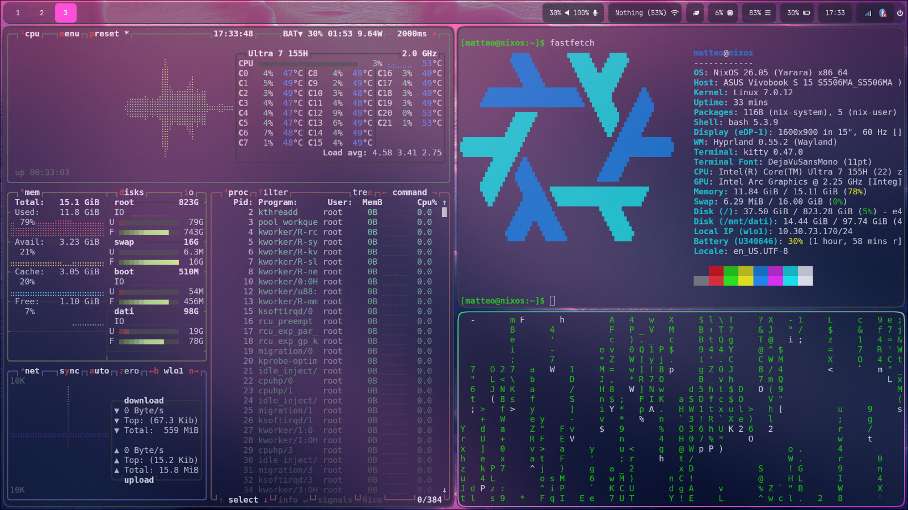

# Hyrpland configuration for NixOS




## Requirements
This Hyprland setup is designed to work together with my main NixOS configuration.  
Make sure to clone and use the following repository as well:

👉 [NixOS Configuration](https://github.com/Matteo7034/nixos-laptop)


## Installation

```
mkdir ~/.config/hypr
git clone https://github.com/Matteo7034/Hyprland-Nixos.git ~/.config/hypr
```
